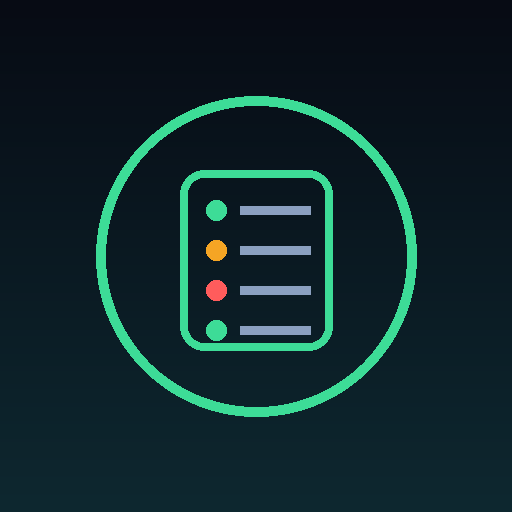
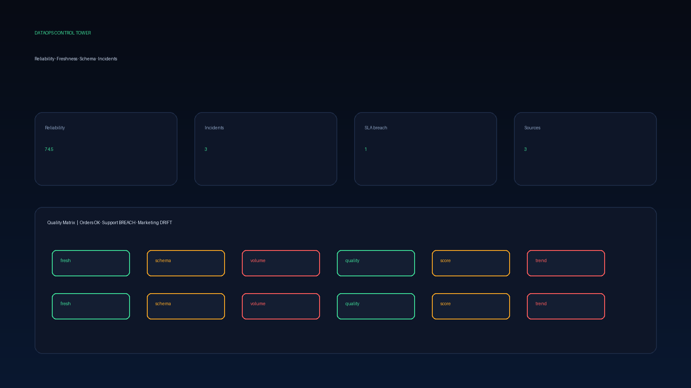
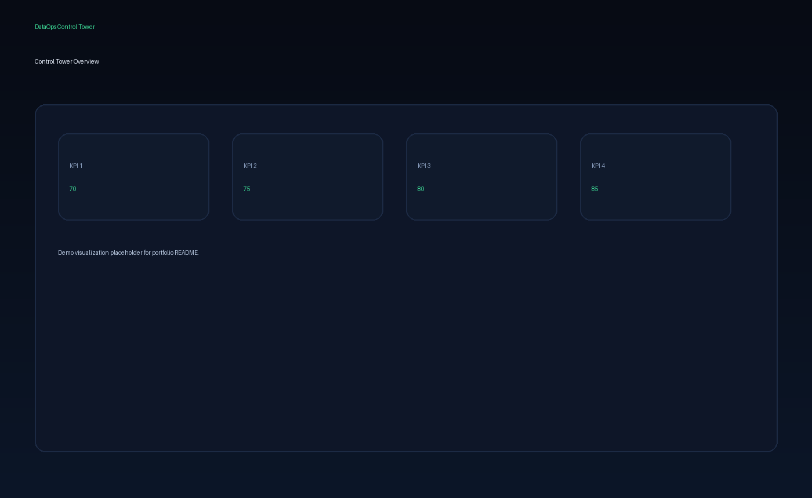
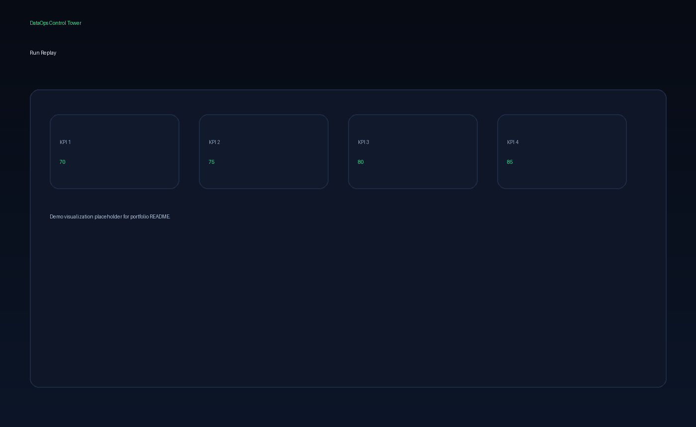
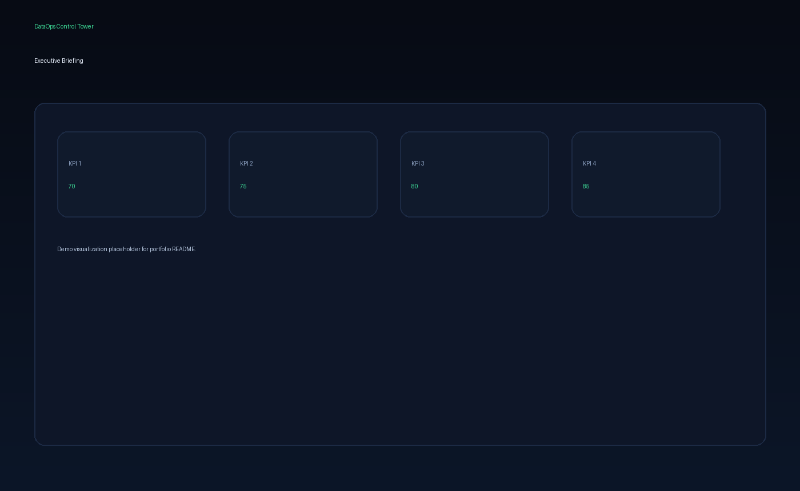
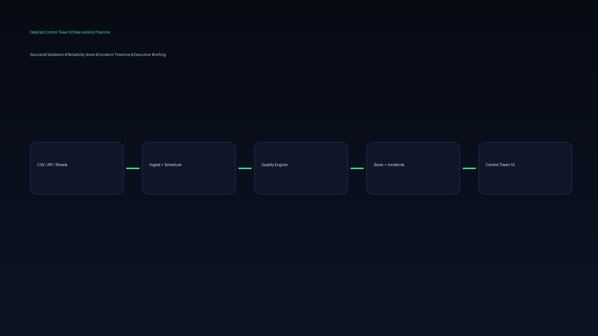

<div align="center">
  

  <h1>DataOps Control Tower</h1>

  <p><strong>Observabilidade de dados para datasets recorrentes: qualidade, frescor, schema, SLA e incidentes.</strong></p>
  <p><strong>Data reliability monitoring for recurring datasets: quality, freshness, schema, SLA and incidents.</strong></p>

  <p>
    <a href="#1-visão-geral--overview">PT-BR / English Overview</a> •
    <a href="#-product-preview">Preview</a> •
    <a href="#-screenshots">Screenshots</a> •
    <a href="#️-stack--tecnologias">Stack</a> •
    <a href="#-arquitetura--architecture">Architecture</a> •
    <a href="#-quick-start--início-rápido">Quick Start</a> •
    <a href="#-autor--author">Author</a>
  </p>

  <p>
    
    
    
    
    
    
  </p>
</div>

<p align="center">
  
</p>

---

## 1. Visão Geral / Overview

O **DataOps Control Tower** é um produto de dados criado para monitorar datasets recorrentes como se fossem sistemas vivos: qualidade, frescor, schema, volume, duplicatas, anomalias, SLA de atualização, drift e incidentes.

Ele automatiza um fluxo de **cadastro de fontes demo (CSV/API/Sheets), execução de checks, score temporal de confiabilidade, registro de incidentes, alertas simulados, dashboard operacional e briefing executivo**. Em vez de descobrir quebra de base só depois que o dashboard já mentiu, o Control Tower transforma confiabilidade em um painel contínuo e acionável.

O projeto foi desenvolvido por **Felipe Alirio Baruja** como peça de portfólio, complementando o DataFlow: enquanto o DataFlow diagnostica uma base pontual, este projeto monitora a confiabilidade ao longo do tempo.

> **Product Scope Notice**  
> O MVP usa **3 conectores demo** (CSV, API mock e Sheets mock). Não é warehouse cloud obrigatório, streaming pesado nem plataforma enterprise completa.

---

## ✨ Product Preview

<p align="center">
  
</p>

O Control Tower apresenta uma experiência dark tipo sala de controle: reliability score, status lights, SLA cards, matriz de qualidade, timeline de incidentes e replay de execução.

---

## 2. Por que este projeto importa? / Why this project matters

* **Dashboards quebram em silêncio:** Muitas equipes só descobrem que a base falhou depois que um relatório ou decisão já foi afetado.
* **Qualidade pontual não basta:** Profiling único não cobre frescor, drift de schema e regressão de volume entre execuções.
* **Incident response precisa de produto:** Severidade, status, ação recomendada e histórico tornam a operação de dados apresentável.
* **Portfólio com maturidade operacional:** Fecha a lacuna entre análise exploratória e observabilidade contínua.

---

## 🧠 O diferencial do Control Tower / What makes it different

### Português
O DataOps Control Tower não é apenas um dashboard de KPIs. Ele combina checks de qualidade, SLA de frescor, detecção de drift, score explicável e issue register em uma experiência de control room.

Ele mostra não apenas o estado atual, mas também:
- quão confiável cada fonte está ao longo do tempo;
- quais SLAs foram violados;
- onde houve drift de schema ou volume;
- quais incidentes estão abertos e o que fazer a seguir;
- como o score foi penalizado por severidade.

### English
DataOps Control Tower is not just a KPI dashboard. It combines quality checks, freshness SLAs, drift detection, an explainable score and an issue register into a control-room experience.

It shows not only the current state, but also:
- how reliable each source is over time;
- which SLAs were breached;
- where schema or volume drift appeared;
- which incidents are open and what to do next;
- how the score was penalized by severity.

---

## 🎯 Problema que resolve / The problem it solves

Em fluxos reais de analytics e operações, bases recorrentes costumam falhar por:
- atraso de atualização fora do SLA;
- mudança silenciosa de schema;
- queda ou explosão de volume;
- nulos e duplicatas crescentes;
- ausência de trilha de incidentes;
- alertas sem priorização;
- relatórios executivos sem contexto de confiabilidade.

O **DataOps Control Tower** cria uma camada de observabilidade entre a ingestão recorrente e a decisão analítica.

---

## 🧩 Proposta / Reliability Pipeline

```txt
CSV / API mock / Sheets mock
  ↓
Scheduled / on-demand run
  ↓
Schema + freshness + volume + null/duplicate checks
  ↓
Explainable reliability score
  ↓
Incident register + recommended action
  ↓
Control Tower dashboard & executive briefing
```

---

## 📸 Screenshots

<table>
  <tr>
    <td width="50%">
      
      <br />
      <sub><strong>SLA Scorecards</strong> — freshness windows, reliability trend and open risk per source.</sub>
    </td>
    <td width="50%">
      
      <br />
      <sub><strong>Quality Matrix</strong> — status lights for freshness, schema, volume and quality.</sub>
    </td>
  </tr>
  <tr>
    <td width="50%">
      
      <br />
      <sub><strong>Incident Timeline</strong> — severity, status, summary and recommended next action.</sub>
    </td>
    <td width="50%">
      
      <br />
      <sub><strong>Run Replay</strong> — execution history with score, row count, freshness and volume delta.</sub>
    </td>
  </tr>
  <tr>
    <td width="50%">
      
      <br />
      <sub><strong>Executive Briefing</strong> — concise reliability narrative for stakeholders.</sub>
    </td>
    <td width="50%">
      
      <br />
      <sub><strong>Control Tower Overview</strong> — dark control-room composition with overall reliability.</sub>
    </td>
  </tr>
</table>

---

## 📌 Estudo de Caso / Case Study

### 📌 Estudo de Caso: Três fontes recorrentes sob SLA
O demo monitora **Orders Daily (CSV)**, **Support Tickets (API mock)** e **Marketing Spend (Sheets mock)**. O tower calcula reliability score por fonte, detecta breach de frescor no suporte, drift de schema no marketing (`leads` ausente) e mantém um issue register com ações recomendadas.

### 📌 Case Study: Three recurring sources under SLA
The demo monitors **Orders Daily (CSV)**, **Support Tickets (API mock)** and **Marketing Spend (Sheets mock)**. The tower computes per-source reliability, detects a support freshness breach, marketing schema drift (missing `leads`) and keeps an issue register with recommended actions.

---

## 🧭 Visual Story / Jornada Operacional

```txt
1. Abrir o Control Tower e ler o overall reliability
2. Identificar SLA breaches e fontes degradadas
3. Inspecionar a Quality Matrix (freshness / schema / volume / quality)
4. Percorrer a Incident Timeline e a próxima ação
5. Revisar Run Replay e deltas de volume
6. Usar o Executive Briefing para comunicar risco
```

---

## ⚙️ Funcionalidades Principais / Core Features

### Control Tower Dashboard
Painel central com reliability score, contagem de fontes, incidentes abertos e breaches de SLA.

### SLA Scorecards
Cards por fonte com janela de frescor, tendência de score e status lights.

### Quality Matrix
Matriz cruzada de freshness, schema, volume e quality para leitura rápida de risco.

### Incident Timeline + Issue Register
Linha do tempo com severidade, status, resumo e ação recomendada.

### Run Replay
Histórico de execuções com score, rows, freshness e volume delta.

### Executive Briefing
Narrativa executiva pronta para stakeholder, sem expor ruído técnico desnecessário.

---

## 🛠️ Stack / Tecnologias

### Frontend
- **Framework:** Next.js 15 (App Router) & React 19
- **Linguagem:** TypeScript
- **Estilização:** Tailwind CSS
- **Componentes:** Control-room UI (SLA cards, matrix, timeline)
- **Ícones / charts:** Lucide-ready + CSS status lights

### Backend
- **Framework API:** FastAPI & Uvicorn (Python 3.12)
- **Modelagem:** Pydantic v2
- **Processamento:** Pandas
- **Checks:** schema, nulls, duplicates, freshness SLA, volume drift
- **Suite de Testes:** Pytest

---

## 🧱 Arquitetura / Architecture

```text
dataops-control-tower/
├── apps/
│   ├── web/                         # Frontend Next.js (App Router)
│   │   ├── src/app/                 # Control Tower page
│   │   ├── src/components/          # SLA, matrix, incidents
│   │   ├── src/lib/                 # API client + fallback snapshot
│   │   └── src/types/               # TypeScript contracts
│   │
│   └── api/                         # Backend FastAPI
│       ├── app/
│       │   ├── api/                 # REST routes (/tower, /incidents, /runs)
│       │   ├── core/                # Settings
│       │   ├── schemas/             # Pydantic models
│       │   └── services/            # Quality engine + demo snapshot
│       └── tests/                   # Pytest quality checks
│
├── data/
│   └── seed/                        # Demo CSV sources
├── docs/                            # Portfolio + methodology
├── assets/                          # Icon, hero, screenshots
├── start.bat                        # Windows integrated launcher
└── README.md
```

---

## 🧱 Visual Architecture

<p align="center">
  
</p>

Sources enter scheduled validation, receive an explainable reliability score, open incidents when thresholds fail, and surface in the Control Tower UI.

---

## 🔁 Data Reliability Pipeline

```txt
Source registration (CSV / API / Sheets mock)
  ↓
Run execution
  ↓
Schema fingerprint + expected columns
  ↓
Freshness vs SLA
  ↓
Null / duplicate / volume drift checks
  ↓
Severity-weighted reliability score
  ↓
Incident open / update
  ↓
Dashboard + executive briefing
```

---

## 🚀 Quick Start / Início Rápido

### Pré-requisitos
- **Node.js** v20 ou superior
- **Python** v3.10+ (preferencialmente 3.12)
- **Git**

### Opção 1 — Execução integrada no Windows
Na pasta raiz do projeto:
```bash
start.bat
```
O script cria o venv, instala dependências, sobe FastAPI (`8000`) e Next.js (`3000`).

### Opção 2 — Execução manual

#### 1. Backend FastAPI (`apps/api`)
```bash
cd apps/api
python -m venv .venv
.venv\Scripts\activate            # Windows
source .venv/bin/activate          # Linux/macOS
pip install -r requirements.txt
uvicorn app.main:app --reload --port 8000
```
*API em [http://127.0.0.1:8000](http://127.0.0.1:8000). Docs em `/docs`.*

#### 2. Frontend Next.js (`apps/web`)
```bash
cd apps/web
npm install
npm run dev
```
*Frontend em [http://localhost:3000](http://localhost:3000).*

---

## 🧪 Scripts e Testes / Scripts and Testing

### Backend
```bash
cd apps/api
.venv\Scripts\python -m pytest
```

### Frontend
```bash
cd apps/web
npm run lint
npm run typecheck
npm run build
```

---

## 📊 Metodologia de Confiabilidade / Reliability Methodology

* **Schema check:** valida colunas esperadas e fingerprint.
* **Freshness SLA:** compara idade do dado com `sla_hours` da fonte.
* **Null / duplicate rates:** limiares configuráveis no engine.
* **Volume drift:** variação percentual vs execução anterior.
* **Score explicável:** parte de 100 e aplica penalidades por severidade (critical −25, high −15, medium −8, low −3).

Detalhes em [docs/quality_methodology.md](./docs/quality_methodology.md).

---

## 🛡️ Segurança e Boas Práticas

* Seeds sintéticos sem PII real (e-mails de exemplo).
* `.env` ignorado; apenas `.env.example` versionado.
* Escopo MVP limitado a 3 conectores demo para evitar plataforma inchada.
* UI possui fallback snapshot se a API estiver offline.

---

## 🧭 Roadmap do Produto

* **MVP:** 3 conectores demo, checks, score, incidentes, dashboard, briefing.
* **Fase 2:** models dbt-like, Slack/email, comparação de releases, data contracts, lineage básico.
* **Fase 3:** orquestração real, incident playbooks, multi-workspace, anomaly detection robusta, catálogo de métricas.

---

## 💼 Valor para Portfólio / Portfolio Value

Demonstra competências de **Analytics Engineering, Data Observability e Data Product**:
- design de produto de confiabilidade;
- pipeline de qualidade temporal;
- incident response com ação recomendada;
- arquitetura full-stack Next.js + FastAPI;
- narrativa executiva de risco de dados.

Roteiro de entrevista: [docs/portfolio_case.md](./docs/portfolio_case.md).

---

## 📚 Documentação Complementar

- [docs/portfolio_case.md](./docs/portfolio_case.md) — posicionamento e talking points
- [docs/quality_methodology.md](./docs/quality_methodology.md) — checks, limiares e score

---

## 🖼️ GitHub Social Preview

```txt
assets/social-preview.png
```
*Dimensão recomendada: 1280x640. Upload em: Repository Settings → Social Preview.*

---

## 🔖 GitHub Repository Metadata

### About sugerido
```txt
Data reliability control tower for recurring datasets — quality, freshness, schema drift, SLA and incidents.
```

### Topics sugeridos
```txt
data-observability
data-quality
analytics-engineering
dataops
fastapi
nextjs
typescript
python
pandas
sla-monitoring
incident-response
portfolio-project
schema-drift
reliability
```

---

## 👤 Autor / Author

Desenvolvido por **Felipe Alirio Baruja**.

- **Portfolio:** [barujafe.vercel.app](https://barujafe.vercel.app/)
- **GitHub:** [@BarujaFe1](https://github.com/BarujaFe1)
- **LinkedIn:** [Gustavo Felipe Alirio Baruja](https://www.linkedin.com/in/barujafe/)

---

## 📄 Licença / License

MIT License. Copyright (c) 2026 Felipe Alirio Baruja.
